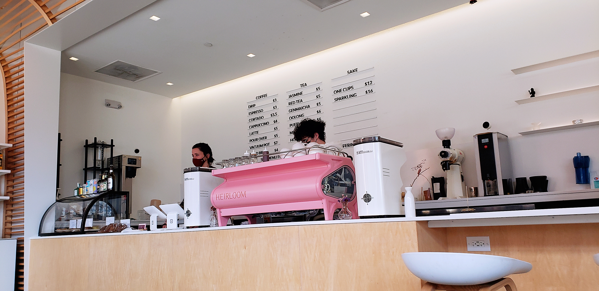
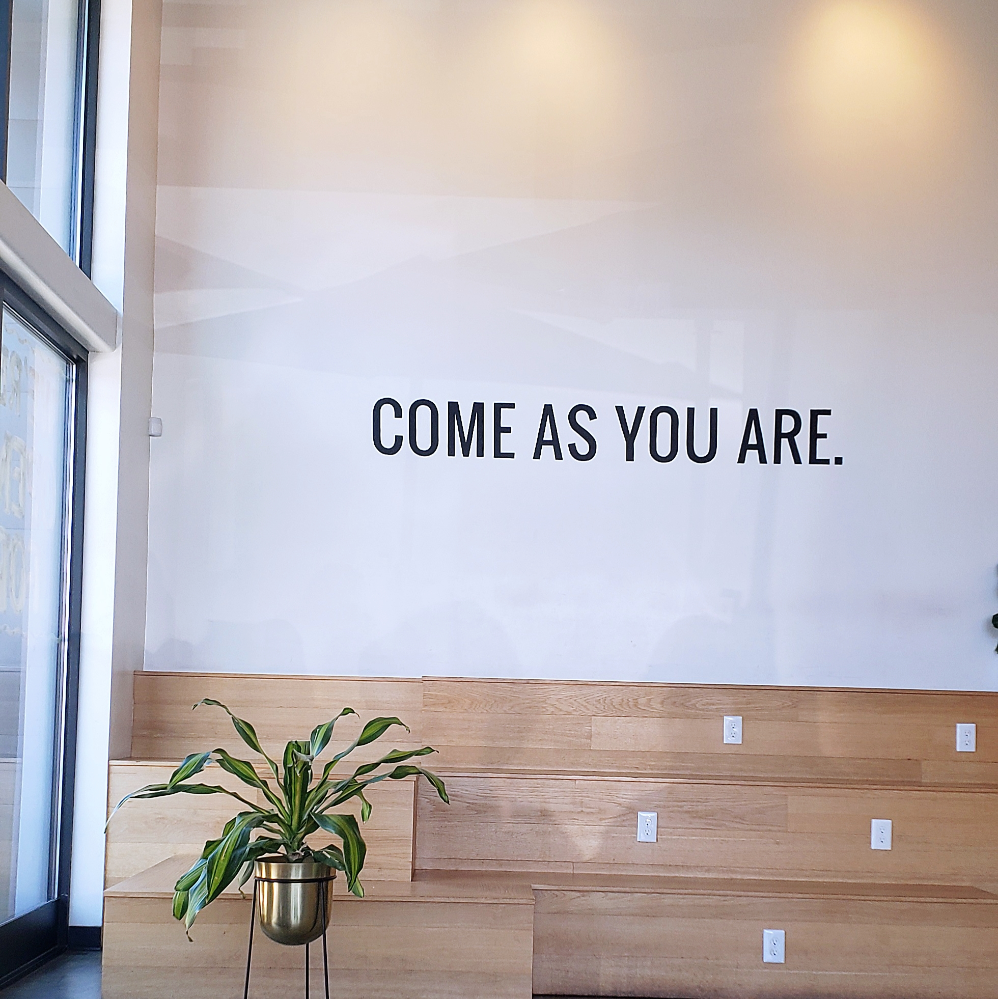
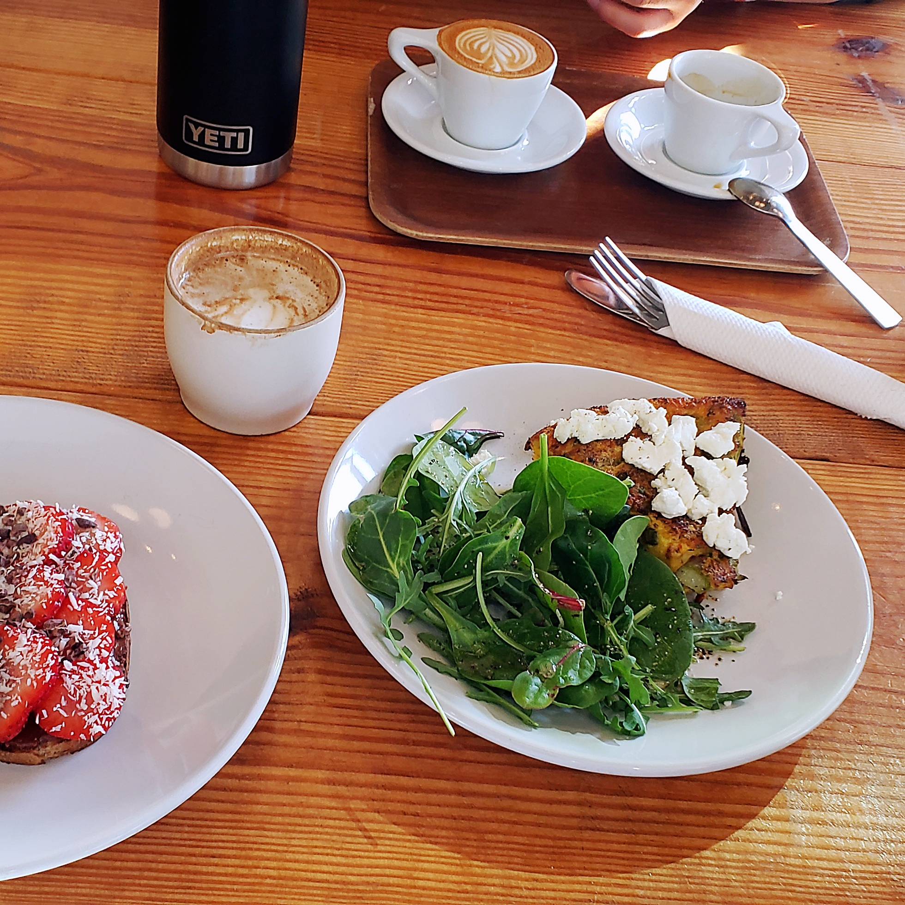

If there's one thing I'm gatekeep-y about, it's finding local cafes before everyone else I know does. Now that I've graduated Duke, I decided it's time to share my amassed knowledge, opinions, and anecdotes no one asked for. At the end of this post, check out what I think is the BEST cafe to do work! Note this guide is focused on which cafes are the best to *be productive* at, whiuch may or may not be the best place to eat/drink/catch up with an estranged friend.

🌕🌗🌑 

### Disclaimer 

All the places mentioned below are local places (i.e. not a certain franchise that begins with \star). I strongly encourage the reader to check them out in person and form your own thoughts about them. At the same time, you can support some cool local businesses! 

(pic of friends don't let friends drink corporate coffee in Miami)

Also, I didn't visit these places alone. I went with [Craig](https://www.craigxchen.com/), who you should actually ask about specialty coffee. All photos are taken by me. The vibes rating is entirely my opinion, which may not mirror yours. 

### Quick Links 

[insert TOC in markdown]

### Top Tier 

#### Liturgy Beverage Company 

[website](https://www.liturgybeverage.com/), [instagram](https://www.instagram.com/liturgybeverage)
Durham Food Hall, 530 Foster St Suite 1, Durham, NC 27701
First Visit: Jun. 2021 

**Working:** 
- Many tables of varying sizes, on the larger end (you can sit anywhere in the Durham Food Hall)
- Rectangle, square tables 

**Vibes:** 
- Aesthetic: careful 

**Note:**  

**Bonus:** We went to a coffee tasting event ... Highly recommend their seasonal menu. 

#### Press Coffee Crêpes Cocktails

[website](https://pressccc.com/), [instagram](https://www.instagram.com/presscccdurham/)
359 Blackwell Street, Durham, NC 27701
First Visit: 

**Working:** 🌕🌕🌕🌕🌑 
- Good amount of sizeable tables 
- Rectangle tables with rounded edges 

**Vibes:** 🌕🌕🌕🌕🌗
- Aesthetic: wood with green accents, European-inspired 

**Note:** If you want to do work here, ONLY go on weekdays. On weekends, it turns into a busy brunch-only place (no pulling out laptops to work). But on weekdays, it's pretty roomy. 

**Bonus:** Their crêpes are really, really good. Mostly everything else on the menu is great too! On weekend brunch days, they have hash brown waffles, which I've never seen anywhere else. 

#### Heirloom - Coffee, Tea, Kitchen 

219 S West St, Raleigh, NC 27603
[website](https://www.heirloombrewshop.com/), [instagram](https://www.instagram.com/heirloombrewshop/)
First Visit: Jan. 2020 

**Working:** 🌕🌕🌕🌕🌑 
- Good amount of sizeable tables 

**Vibes:** 🌕🌕🌕🌕🌗
- Aesthetic: wood with a few pink accents, plants, vaguely Asian 

**Note:** I had this saved in my "Want to go" for a while, but I never ended up going until this year. (To be fair, it's in Raleigh, and the drive there sucks a little bit.) 

**Bonus:** They serve Laos/Taiwan/Japan-inspired dishes that are pretty tasty. There's also a collection of Asian beers and wines! 

#### Cha House 

ADDRESS
LINKS

**Working:** 
- 

**Vibes:** 
- Aesthetic: 

**Note:** 

**Bonus:** 

#### People's Coffee 

ADDRESS
LINKS 

**Working:** 
- 

**Vibes:** 
- Aesthetic: 

**Note:** 

**Bonus:** 

#### Namu 

[website](https://www.namudurham.com/), [instagram](https://www.instagram.com/namudurham/), [facebook](https://www.facebook.com/namudurham/), [twitter](https://twitter.com/namudurham), [yelp](https://www.yelp.com/biz/namu-durham)

**Working:** 🌕🌕🌕🌕🌕 
- Many, many tables of all sizes 
- Extensive outdoor seating (in a garden, surrounded by bamboo, or on a patio) 
- Rectangle tables 

**Vibes:** 🌕🌕🌕🌗🌑 
- Aesthetic: eclectic, 

**Note:** I would come here to work on weekdays - there are so many tables to choose from, including square wooden ones all the way to long picnic benches. Saturdays are very crowded, and the parking lot does not lend itself to easy parking. There's also a variety of beers on tap, if you're into that. 

**Bonus:** 

### Worth Visiting 

#### Jetplane Coffee 

ADDRESS
LINKS

**Working:** 
- 

**Vibes:** 
- Aesthetic: 

**Note:** 

**Bonus:** 

#### Cocoa Cinnamon 

ADDRESS
LINKS

**Working:** 
- 

**Vibes:** 
- Aesthetic: 

**Note:** 

#### Foster Street Coffee 

ADDRESS
LINKS

**Working:** 
- 

**Vibes:** 
- Aesthetic: 

**Note:** 

**Bonus:** 

#### Everlou Coffee Co. 

ADDRESS
LINKS

**Working:** 
- 

**Vibes:** 
- Aesthetic: 

**Note:** 

**Bonus:** 

#### Perennial 

ADDRESS
LINKS

**Working:** 
- 

**Vibes:** 
- Aesthetic: 

**Note:** 

**Bonus:** 

#### Guglhupf Bakery, Cafe & Biergarten

ADDRESS
LINKS

**Working:** 
- 

**Vibes:** 
- Aesthetic: 

**Note:** 

**Bonus:** 

### Honorable Mentions 

#### Meeple's Brew 

9545 Chapel Hill Rd, Morrisville, NC 27560

**Working:** 🌕🌕🌕🌗🌑 
- A few very large tables 
- Rectangle tables 

**Vibes:** 🌕🌕🌕🌑🌑
- Aesthetic: 

**Note:** BTW, you can pay $5 to have access to the massive selection of board games. 

#### Boba Baba 

ADDRESS
LINKS

**Working:** 
- 

**Vibes:** 
- Aesthetic: 

**Note:** 

#### Cloche Coffee 

ADDRESS
LINKS

**Working:** 
- 

**Vibes:** 
- Aesthetic: 

**Note:** 

#### Triangle Coffee House 

ADDRESS
LINKS

**Working:** 
- 

**Vibes:** 
- Aesthetic: 

**Note:** 

### The Crown Jewel 

#### Fount Coffee + Kitchen 

  

    
  

  

    
  

  

    
  

[website](https://fountcoffee.com/), [instagram](https://www.instagram.com/fountcoffee/)  
10954 Chapel Hill Rd Ste 109, Morrisville, NC 27560  
First Visit: Sep. 2020 

**Working:** 🌕🌕🌕🌕🌕 
- Lots of big tables
- Good amount of outside seating 
- Rectangle, square tables (some circles outside)

**Vibes:** 🌕🌕🌕🌕🌕
- Aesthetic: wood and clean white countertops, many plants 
- Staff is extremely friendly (you can easily converse with them)

**Note:** I found this place by accident when I was taking part in the DukeEngage Durham program during my freshman summer. I went to the government office next door to get my UK Work Visa (the program took place in Durham, NC and Durham, UK), but on the way I peered in what looked like a really cool cafe. I promptly saved it in my "Want to go" list in Google Maps, but we didn't get the chance to go until junior year. We loved it so much we would uber there every week. Even now, almost nothing can stop us from going to our weekly Fount trip. 

**Bonue:** Pretty much the entire menu of food and drinks is delicious. I would recommend anything on the seasonal menu. 

List of all 

- Joe Van Gogh 
- Sir Walter Coffee 
- Epilogue 

Alphabetical Order 

- Boba Baba 
- Cha House 
- Cloche Coffee
- Cocoa Cinnamon 
- Everlou Coffee Co. 
- Foster Street Coffee 
- Fount Coffee + Kitchen 
- Guglhupf Bakery, Cafe & Biergarten 
- Heirloom - Coffee, Tea, Kitchen 
- Jetplane Coffee
- Liturgy Beverage Company 
- Meeple's Brew 
- People's Coffee 
- Perennial 
- Press Coffee Crêpes Cocktails 
- Triangle Coffee House 