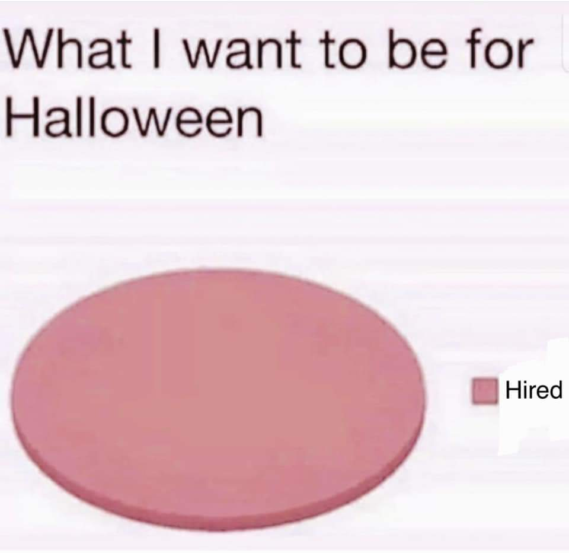
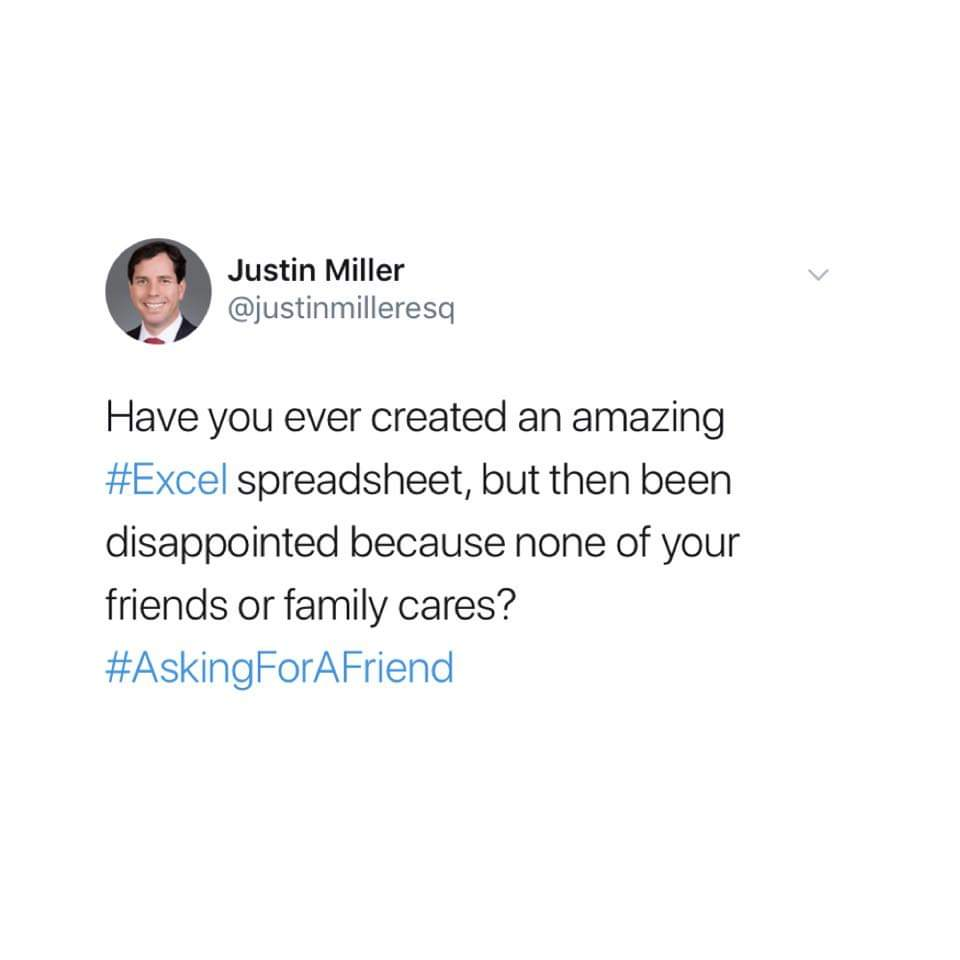
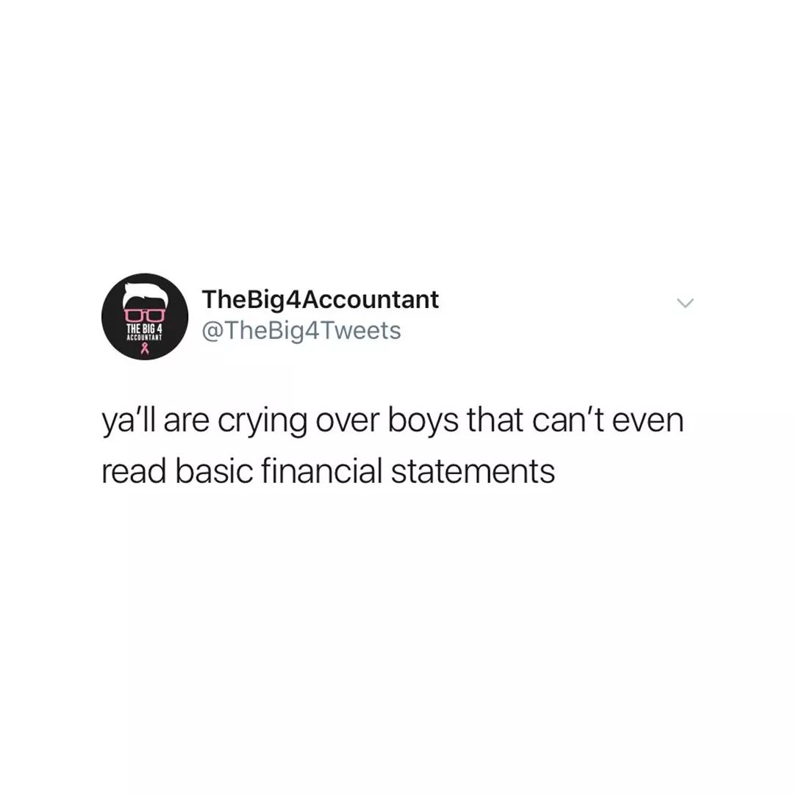

I'm in my last year of college. The previous semester, after disliking my summer internship experience in finance, I spent a lot of time working through a latent crisis brewing under all my efforts to enjoy my final school year. Nearly all my friends have accepted return offers, while I am still unemployed. I carefully considered what I wanted to do, no --- what I even *could* do for a job that could take up half of my waking hours. This post details how, after 3 years of being committed to finance, I suddenly decided to take a different path. 

### Once upon a time... 

I was a college freshman. Since literally before Day 1, people started talking about what to do after college. Looking back, this phenomenon makes sense --- everything in high school was prepared for getting into a "good college". It made us all obsessed with thinking what happens *after*. I noticed people generally fell into three camps: 

1. pre-med (I'm not personally interested) 
2. business (whatever that means) 
3. "I have no clue" (relatable, but it's unsatisfying to hear this) 

Of all discussions of what "business" was, I heard the most about Investment Banking (IB). That's what was *cool*, and I had some lofty image of being some Wall Street hotshot. I played into the herd mentality and convinced myself I wanted an IB job at a large bank. (Later, I changed my goal to a Sales & Trading internship, but still at a name-brand bank.)

But you can't pull a bulge-bracket bank internship out of nowhere; you need to collect applicable experiences and build your network. Duke doesn't have an undergraduate business program, so we flocked to business societies, clubs, and social groups that boasted alumni connections and exclusive networking opportunities, with the added bonus of a solid friend group. For first-years desperate to make connections with peers and anxious to start preparing for *beyond college*, these groups were ideal to join.  

### Typical Failure Arc, then Success 

However, unlike everyone else (or so I thought), I was unsuccessful in recruiting for these clubs. I was cut first round from Delta Sigma Pi (a business-focused fraternity group) and flat-out rejected from Duke Business Society. What's worse was that I was twice (!) denied from Business Oriented Women (BOW), to which I heard was exclaimed, "doesn't everyone make it in BOW?"[^1] --- anyone else I knew who applied made it the first time around. Needless to say, I was disheartened.

I realized I didn't need these clubs to get the coveted finance internship. All I had to do was schedule calls, ask for contacts, come up with a short intro of myself, think of stock pitches, study the technicals, prepare answers to common behavioral questions, and do mock interviews by myself, all of which I shorthanded into "playing the game". 

And so I played this game for a year. Then, I won. I got multiple Super Days and accepted a junior summer offer at a big bank near the end of my sophomore year. I thought something along the lines of, "I hope I don't lose interest in finance some time in the 1+ years before my internship," which is some sick foreshadowing, to be honest. 

### You Know the End of This Story  

As with all disappointments, what I got didn't match up with what I expected. 

**Expectation:** flat hierarchy. Everyone I talked to claimed S&T was especially flat, since you sit next to your bosses and do the "exact same thing, just on a smaller scale". 

**Reality:** Hierarchy is too ingrained in these companies' DNA, especially where I worked, where there were 200,000+ employees. I was too idealistic and thought somehow it'd be OK. 

**Expectation:** collaborative culture. Everyone also prioritized the development of young talent. 

**Reality:** Again, I was naive. I realized I fell under the spell of selection bias: the people who were passionate about being nice and helping new recruits were the ones willing to come to events on campus and get on calls with ignorant college kids, giving me an impression different from the actual workplace environment. 

**Expectation:** S&T emphasizes critical thinking skills and decision making in low-information environments. Thus, with recruiting, there's not many technical questions, but rather testing to see if you can think critically, form opinions, and defend said opinions. Everything else (niche stock knowledge, Bloomberg commands, etc.) you can learn on the job. 

**Reality:** Looking back, the first warning sign during my internship was when I wrote a document summarizing the rate of COVID-19 testing and what I thought would be the trend in the future. My manager praised my work, especially the fact that I gave my own views with reasoning, which was "something not many interns do". I was confused --- isn't the whole point of S&T that the only thing you needed was the ability to develop strong but flexible, defendable views? And then, I was being told that having this ability was uncommon. 

**Expectation:** Traders welcome new ways of thinking and fresh perspectives, basically anything that can give you an edge over other traders. 

**Reality:** There is one path to success: do what everyone else was doing. And everyone else was only doing what they were doing because that's what we were told to do in order to succeed. Second warning sign: an MD literally recommended us to "keep our head down" and just diligently do what the higher-ups told us to. 

**Expectation:** fun, meaningful work. 

**Reality:** On popular desks[^2], you don't even trade until 2+ years in. Someone I talked to said her analyst years were "miserable". Everyone I talked to agreed that the first few years were "a grind". 

What does that mean, exactly? During your analyst years, developing a life outside work is hard.[^3] The prospects of throwing away 2 years of my life just to be promoted to an associate, then vice president, etc., seemed so pointless. Even as an intern, the expected trajectory ahead of me felt extremely unsatisfying. 

Plus, even getting to be an associate didn't sound enjoyable. Someone remarked that the placement process is "just like sorority rush", which I wanted nothing to do with. 

**The worst part:** that (basically) no one shared my sentiments. I didn't want my only identity to be my job. I wanted to develop myself personally and have my own hobbies/interests/friends outside of my professional career. I wanted the quality of my work to be noticed, not just that I "showed enough interest". That all felt reasonable to me, so why did my peers think otherwise? 

### What next? 

At first, I thought, well, maybe if I went to *x* or *y* bank instead, it would've been a better experience. But how different could it be? Everyone I talked to said the work was the same across all banks, with "culture" or "people" being the only difference. So I decided the only thing to do is pivot, and pivot hard. Goodbye, Big Finance.  

For most of college I had an answer to the terrifying question, "What do you want to do after graduation?" Suddenly, I didn't anymore, and that was even more scary. Hence my senior year crisis about employment. After all, is it even realistic to say I want to have a job that I actually enjoy + find meaning in, and at the same time surround myself with genuine people who care about me as a person? Who knows... I'm in the middle of finding out! 

### Relevant Memes 

  
&nbsp; &nbsp; &nbsp; &nbsp;
  
&nbsp; &nbsp; &nbsp; &nbsp;
  

  
&nbsp; &nbsp; &nbsp; &nbsp;
  
&nbsp; &nbsp; &nbsp; &nbsp;
  

---

[^1]: I believe BOW has a (relatively) high acceptance rate. 
[^2]: Where I was at, credit trading desks were highly sought after. 
[^3]: Many remarked, "at least it's better than investment banking hours!", as if almost everything weren't better than a 90-hour work week... So it's a meaningless statement. 
