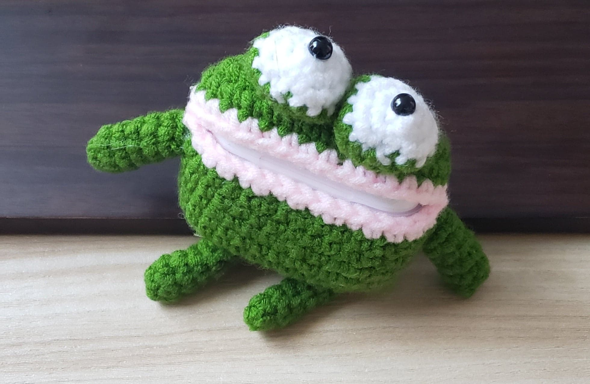
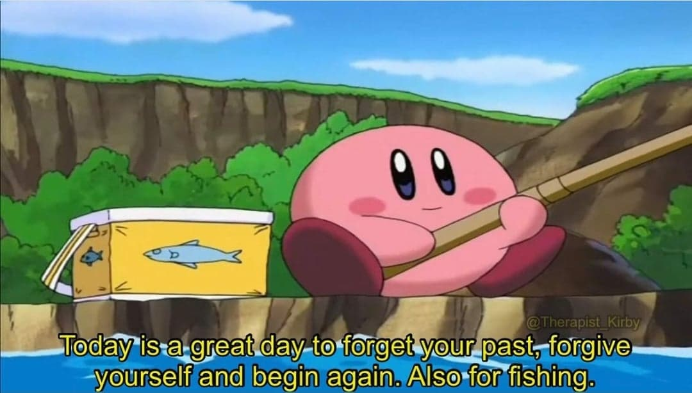
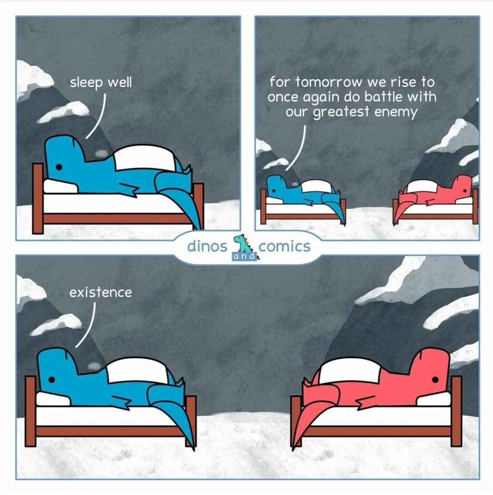
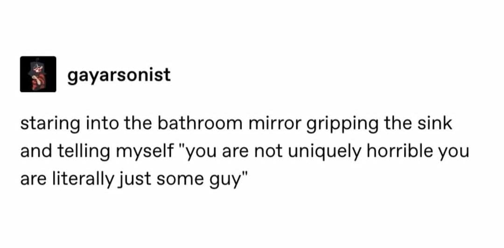

I know all of you have been eagerly waiting for a new blog post, so here it is. I'd like to write more casual pieces for my blog as well. The context for today is: for a good amount of my last semester at Duke, I went through a serious slump and depressive episode. This article describes part of my journey getting out of that and future outlook. 

### 🐶 Did you really think you were so different from other animals? 

Many years ago, I saw an [article](https://www.sciencedirect.com/science/article/abs/pii/S1558787814000379) about how tigers get bored at certain zoos. I swear I saw some post about how giving them pumpkins to roll around helped that boredom, but I can't for the life of me (in one Google search) find anything about that. Rolling the pumpkins is an example of an enrichment tactic, or mental stimulation for the tiger's well-being. 

The pandemic and videos of [Bunny the dog](https://en.wikipedia.org/wiki/Bunny_(dog))[^1] has made [behavioral enrichment](https://en.wikipedia.org/wiki/Behavioral_enrichment) come to the forefront of my mind. 

### 🎇 How to spark joy 
 
It's obvious that a lack of enrichment can make depressive feelings worse. In the first place, depression can make someone uninterested in the usual things that bring them joy, which causes a downward cycle of inactivity and further depression. Anything that re-sparks some kind of less-negative feeling is therefore an important part of getting out of a depressive episode. This is not a novel idea, but it's definitely easy to forget in the midst of a low mental health period, and it's definitely easier said than done. 

The keywords are "less-negative feeling," meaning whatever you do doesn't have to bring yourself to an absolute positive feeling, but rather it's enough to have it be net positive. One example is when I bought this knit frog airpods case: 

  

It looks absolutely ridiculous, and that made me feel the tiniest bit better to see it on my desk. Other examples include keeping at least one thing going (in my case, my Duolingo streak), or appreciating seeing a bee buzz around the flowers on campus. 

For anyone going through a similar struggle, I hope you find solace soon. We both know my words of advice won't help much if you're really going through it, but I firmly believe in you. The "this too shall pass" narrative is unfortunately overused and extremely cliché... but also painfully true. 

### 🎈 Object Permanency is Overrated 

I don't have to explain why commitment as a trait is important when accomplishing goals. However, I notice we tend to assume the commitment period must be the "forseeable forever," otherwise whatever venture we wanted to explore is deemed a unsuccessful, i.e., when things are a "phase". 

This phenomenon can cause start-paralysis, for example, not starting a workout routine because you don't believe you can keep up for more than 2 weeks. It's good to remember that 2 weeks of workout is technically better than no weeks of workout. 

The fact that our needs change isn't inherently bad. You wouldn't blame someone for not staying at a job that just wasn't working for them anymore. Similarly, just because your "no frozen food phase" ended doesn't mean it was a failed attempt at eating healthier. 

### ➡️ What next, again? 

We've established a possible issue with building better habits is that daily lives and interests are constantly changing. Something that works for me now (e.g. X minutes of Y per week) may not be optimal a month later. Thus, the key is not only enrichment, but knowing when to change up the enrichment when necessary. It follows that my theme for the next few months is achieving a healthy level of anti-bored enrichment. To help, I built a [Productivity Menu](https://coda.io/@christine-yang/productivity-menu) page on coda.io, which includes a productivity tracker. Since I also want to read more, I made a [Personal Library](https://coda.io/@christine-yang/personal-library) page as well that has virtual bookshelf and reading log functionality. (Click on the links to play with them!)

I wish myself luck! 

### Relevant Memes 

 
  
&nbsp; &nbsp; &nbsp; &nbsp;
  
&nbsp; &nbsp; &nbsp; &nbsp;
  

 
  
&nbsp; &nbsp; &nbsp; &nbsp;
  
&nbsp; &nbsp; &nbsp; &nbsp;
  

---

[^1]: The [videos](https://www.instagram.com/whataboutbunny/) featuring Bunny and her owner are delightful. Yes, it directly relates to the [Chinese Room Argument](https://plato.stanford.edu/entries/chinese-room/), but I honestly don't care too much since the videos are so cute and compelling. 
