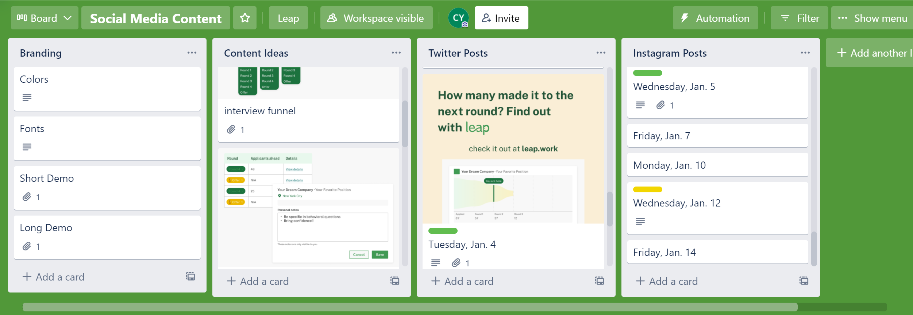

From November 2021 to January 2022, I worked part-time as a community manager intern at [Leap](https://leap.work), a startup I got to know through Duke alum [Francesca Tang](https://frtang.mycpanel.princeton.edu/). Leap is committed to making transparency the foundation of hiring. With a free account, users can 
- track their applications/interviews
- see how many applicants make it to the next round
- chat anonymously with other applicants
- ask industry experts for advice 

My main job was to manage Leap's [Instagram](https://www.instagram.com/leap.work) and [Twitter](https://twitter.com/leap_work) accounts. 

### Community and Social Media  

We knew we wanted to **focus on potential Gen-Z users** applying to internship and new grad positions. Thus, we decided it would be attractive to post clean graphics explaining what we do and relevant memes + captions. At the same time, I made sure to be active in comments, replies, and similar posts made by influencers. 

To plan out content, I made a Trello board: 

### Sample Posts 

#### Instagram 

(edit)

#### Twitter 

(edit)
