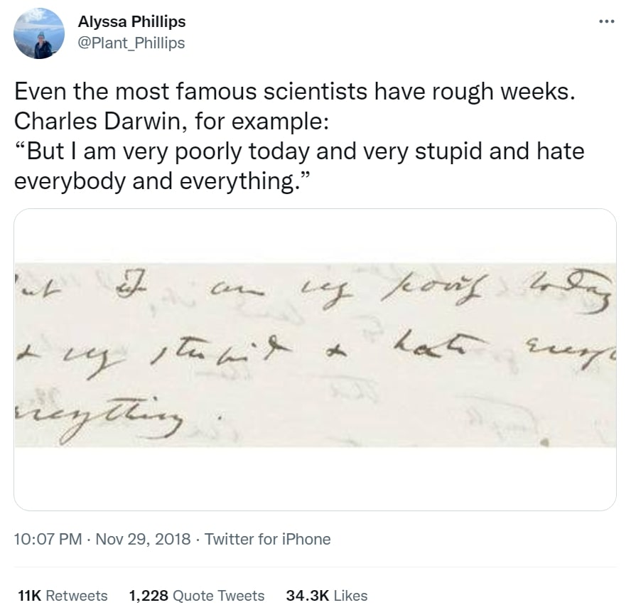

In 8th grade, I tried writing in my copy of *The Old Man and the Sea* because I thought my teacher’s annotated version looked cool. Unfortunately, my handwriting didn’t turn out to be perfectly consistent, and I couldn’t bear looking at it, so I erased it all after only a page. 

That’s how I always used to keep my books - pristine - that meant no folds, notes, underlines, highlights, or anything else. Part of this desire was fed by some sense of perfectionism: if it wasn’t a perfectly straight line of highlight, or a perfect annotation, then it couldn’t be included at all. Since it’s impossible to make it all perfect, the fear of ugly margin notes and crooked lines kept me from marking up my books. Furthermore, I felt like the value decreased if I didn’t keep it clean.[^1] 

It wasn’t until I started consciously thinking of books as something beyond an amalgamation of words that I changed this habit. In fact, I took an entire class at Duke on this subject at called the History of the Book.[^2] 

I was sold on this class when the description mentioned we’d go on field trips to the Rubenstein Rare Manuscript Library. It turns out that books with evidence of multiple owners’ stamps or scrawled, faded annotations (some made by the same person at different times) were the most interesting. We would all crowd around the librarian as they carefully flipped through the delicate pages of these books, some of which were centuries older than us. 

Each book had a story that it told not only through its physical text but also as a meta-story of itself: whether it was carved in clay, written with reed pens and rolled up, inked using stamps and mass produced, passed through multiple hands, or disappeared in history only to show up at some Baron’s house in England, this meta-story can turn out to be as interesting as the text itself. 

Even if you don’t think the joy of going through the book’s meta-story or the lives of its owners can be interesting in its own right, consider the implications it has on historical study. For example, reading someone’s margin notes from the 18th century can indicate the thoughts and ideas of the time. And humans, who are endlessly good at trying to create connections, find that we can empathize with a fellow person through time and space through writing. 

Thus, the value of a marked book may go down monetarily, but it goes up in a different way. 

For a while, I’ve been latently obsessed with a lofty, personalized idea of posterity in minor ways. Some habits of mine add up so that if a modern day Vesuvius happens in New Jersey, USA, later historians can use my preserved records as a case study: 

- Often, my journal entries are written as if someone (not myself) in the far future were to read them. 
- My upkeep of an extensive (online) personal library and closet organization is mostly for my own sake, but it’s a tiny bit for the off chance that someone studying people of the early 2000s can see what one anonymous person read or wore. 
- Photos and school notes are backed up in multiple locations, again mostly for my own sake, but just in case a later scientist wants to see what life was like at this time. 

Keeping the physical copies of my books in good condition is also a way to feed into my tiny obsession with posterity. That way, later people can find and read the books I’ve also read. But marking up my books can still be consistent with that idea. Each crooked line of highlight, each point of connection I write about in the margins, is an extension of my thoughts and reality, of my lived experience. Besides, it’s probably good for (my abstract notion of) “posterity” to point out the most important lines in a book or to include clarifications on unclear passages. (If it turns out to be a wrong interpretation, all the better.) 

In a sort of false-profound way, it’s some proof that I existed, that I was here. I actually used to not care at all about that, but I’ve been thinking differently nowadays - about what kind of residue I’d leave behind. 

---

[^1]: maybe this feeling came from when my mom wouldn’t allow my brother to write in workbooks when he was a kid. He wrote answers in a separate notebook because then I could reuse the workbook when I came of age. Did this happen to anyone else? 

[^2]: Interestingly, I got polarized reviews when I said I was taking a history of the book class. A few friends said that’s “really cool”, and another person I know said “Ugh… Well as long as you like it, Christine,” which is what you say to your friend when they show you a picture of the new guy they’re talking to, but he’s ugly.
