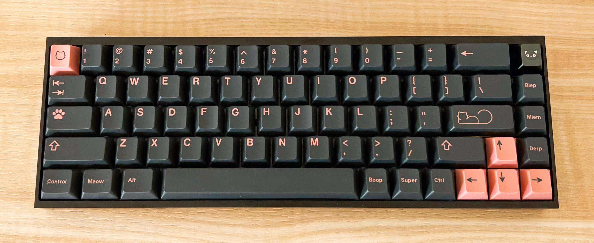
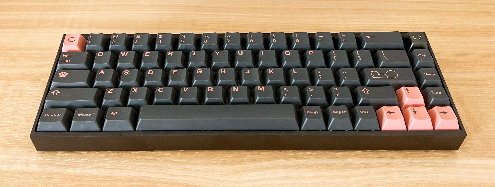
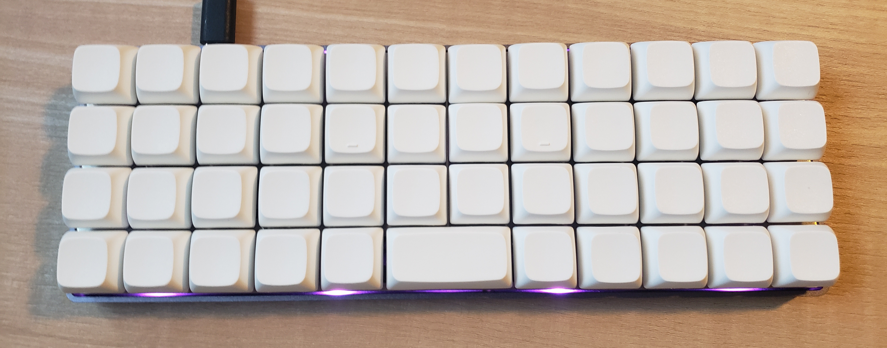
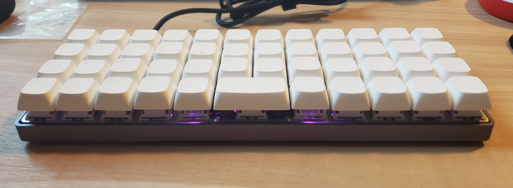
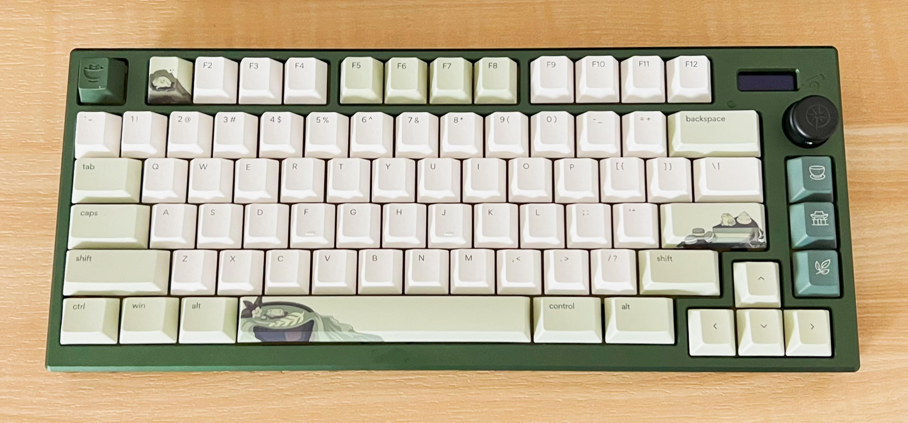
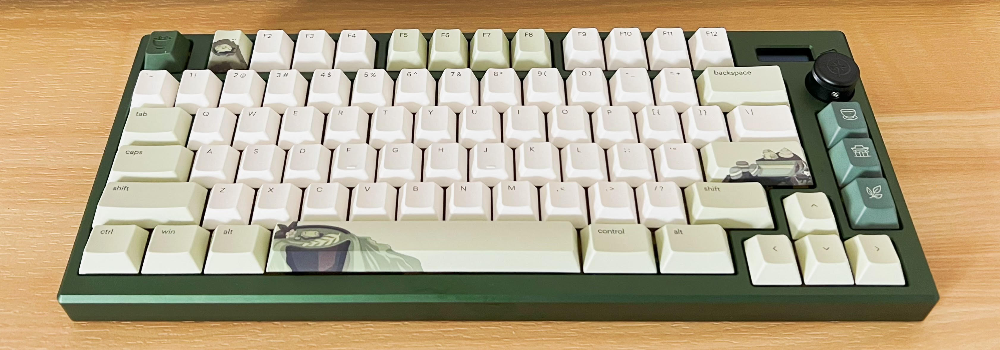
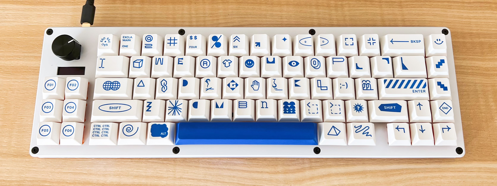
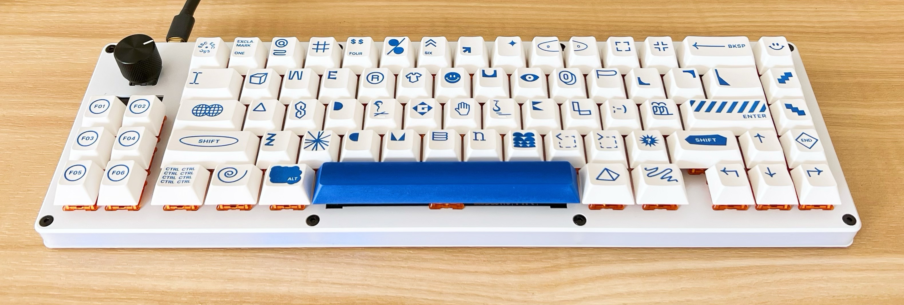
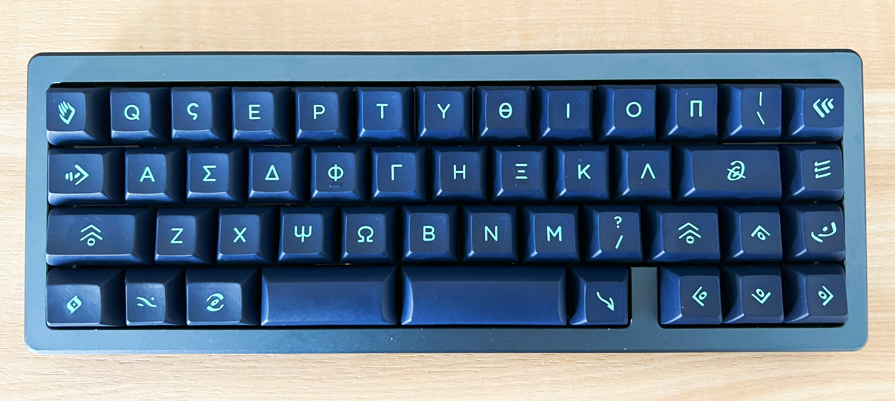
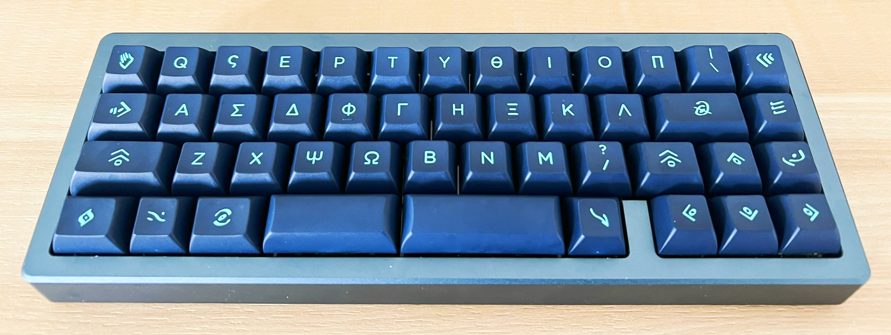

This post details my experience and processes building my keyboards. 

### Table of Contents
- [Tofu65](#Tofu), an entry-level 65%
- [Planck](#Planck), a beginner ortholinear 40%
- [Satisfaction75](#Sat), an extremely hyped 75% 
- [EVO70](#Evo), a fantastic 70% 
- [S46](#Sam), a bluetooth 40% 
- [Mercutio](#Mercutio), a nifty through-hole 40%

_________________

## 🐈 Tofu65 

- Tofu65 Hotswap V3 DIY Kit ([KBDfans](https://kbdfans.com/products/dz68rgb-customize-keyboard-diy-kit))
   - black case
   - polycarbonate plate 
- Gazzew U4 Boba Silent Tactile switches ([SwagKeys](https://swagkeys.com/products/gazzew-u4-boba-silent-tactile-switches))
   - Tribosys 3203 lubricant ([Divinikey](https://divinikey.com/products/tribosys-3203-switch-lubricant))
- Durock V2 screw-in stabilizers ([Divinikey](https://divinikey.com/products/durock-v2-stabilizers-screw-in))
   - Krytox 205G0 lubricant ([Divinikey](https://divinikey.com/products/krytox-gpl-205-grade-0-switch-lubricant))
- GMK Pono keycaps, Cherry profile (bought unsealed from [r/mechmarket](https://www.reddit.com/r/mechmarket/))
   - included the RAMA x Gray Kitty metal artisan 

### The Process 

#### Lubing Switches 

While many switches come factory lubed, it is usually recommended to hand-lube them as well to your preference. The process from disassemling a switch and lubing it is detailed in this [Taeha Types video](https://youtu.be/44Wv4OGdmu4). Below are videos of my process. 

   <iframe width="300" height="300" src="https://www.youtube.com/embed/CfBYfgrrXYw" title="Opening Switches" frameborder="0" allow="accelerometer; autoplay; clipboard-write; encrypted-media; gyroscope; picture-in-picture" allowfullscreen></iframe> 

    Ignore background noise. It was a struggle filming this and concentrating on opening the switches at the same time.

   <iframe width="300" height="300" src="https://www.youtube.com/embed/hG-xDyr9Lek" title="Lubing Switches" frameborder="0" allow="accelerometer; autoplay; clipboard-write; encrypted-media; gyroscope; picture-in-picture" allowfullscreen></iframe> 

#### Lubing Stabilizers 

Stabilizers keep the longer keys (ex. shift, space bar) on the keyboard from wobbling. Lubing stabilizers is considered the most important keyboard mod as it makes the greatest difference. I followed this [Taeha Types video](https://youtu.be/usNx1_d0HbQ) for lubing the stabilizers. 

   <iframe width="300" height="300" src="https://www.youtube.com/embed/UNaTip3VXS0" title="Lubing Stabilizers" frameborder="0" allow="accelerometer; autoplay; clipboard-write; encrypted-media; gyroscope; picture-in-picture" allowfullscreen></iframe> 

#### Assembling Pieces 

The last thing to do is put all the pieces together! I didn't take a video of this, but usually you can find specific instructions online. To be honest, I installed the stabilizers incorrectly twice, so I'll be careful of that next time. 

### Conclusion 

I am extremely satisfied with my first keyboard build. I chose a 65% layout because I felt like it was the perfect balance of convenience. It has silent switches, so I don't have to worry about annoying everyone at the library. Next time, I hope to experiment with linear switches. The only thing I dislike is how heavy it is (although I believe it is a "normal" weight for a good mechanical keyboard). 

## 👨‍🔬 Planck 

- Planck Mechanical Keyboard Kit V6 ([Drop](https://drop.com/buy/planck-mechanical-keyboard))
   - mid-pro case style 
   - purple case color
   - steel plate 
- Hippo Linear switches ([Kinetic Labs](https://kineticlabs.store/switches/kinetic/hippos))
   - Krytox 205G0 lubricant ([Divinikey](https://divinikey.com/products/krytox-gpl-205-grade-0-switch-lubricant))
- Durock V2 screw-in stabilizers ([Divinikey](https://divinikey.com/products/durock-v2-stabilizers-screw-in))
   - Krytox 205G0 lubricant ([Divinikey](https://divinikey.com/products/krytox-gpl-205-grade-0-switch-lubricant))
- Blank PBT keycaps, NP profile ([KBDfans](https://kbdfans.com/products/np-pbt-blank-white-keycaps-set-124-keys)) 

### The Process 

Below is a minute-long summary of putting the keyboard together. 

   <iframe width="560" height="315" src="https://www.youtube.com/embed/-KJY0dJCA0E?si=NK-qgRI9e7LDr2KR" title="YouTube video player" frameborder="0" allow="accelerometer; autoplay; clipboard-write; encrypted-media; gyroscope; picture-in-picture; web-share" referrerpolicy="strict-origin-when-cross-origin" allowfullscreen></iframe>

### Conclusion 

It took way less time than expected to get used to the ortholinear keyboard layout, but I am still way slower on it than on the staggered layout. Not only did I have to get used to an ortholinear layout, I also had to get used to using the layers (to type numbers and most symbols) all while on a blank keycap set. Go big or go home. I'm also satisfied with how the Hippo switches sound and feel. My favorite part is how portable this keyboard is! 

## 🍵 Satisfaction75 

- Satisfaction75 Keyboard Kit ([CannonKeys](https://cannonkeys.com/collections/satisfaction-75))
   - Seaweed Green case color 
   - brass plate 
- Tecsee Coffee Chip Ice Cream Tactile switches ([CannonKeys](https://cannonkeys.com/products/coffee-chip-ice-cream-switch))
   - Tribosys 3203 lubricant ([Divinikey](https://divinikey.com/products/tribosys-3203-switch-lubricant))
- Owlstab V2 screw-in stabilizers ([Qwertykeys](https://www.qwertykeys.com/products/owlstab-beta-ver-2-updating))
   - Krytox 205G0 lubricant ([Divinikey](https://divinikey.com/products/krytox-gpl-205-grade-0-switch-lubricant)) 
- Osume Matcha keycaps, cafe novelty kit and metal artisan ([Osume](https://www.osumekeys.com/product/matcha))

### The Process 

When the Sat75 extras drop was announced by CannonKeys, I literally blocked the time on my calendar. Luckily, I have experience registering for classes. At exactly 11am, I joined the waitlist and was randomly selected to snag a B-stock kit. To be honest, I only notice the tiniest of blemishes if I *really* look for them, so I think it's a great value. 

To build it, I used the soldering iron at Duke's [Co-lab](https://colab.duke.edu/) -- I paid tuition, so might as well go use it at least once. This was the first time in my life that I did anything remotely hands-on DIY, much less handling an 800-degree small metal melter. 

### OLED and Rotary Knob 

This keyboard is my first one with a mini-OLED screen and rotary encoder. Are they really useful, or just hyped gimmicks? My answer is: both. But who cares? It sparks so much joy[^1] to see what layer you're on or changing your music's volume with a rotation. Of course, I installed (an open-source) [Bongo Cat](https://github.com/atude/sat75-oled-mods) for the OLED. 

## 💙 EVO70 

 

- EVO70 Keyboard Kit, B Stock ([CustomMK](https://shop.custommk.com/collections/evo70/products/evo70))
   - Aluminum/Acrylic material, E-white color
- Prevail Epsilon switches ([Prevail Key Co](https://prevailkeyco.com/products/prevail-epsilon-switches))
- Owlstab V2 screw-in stabilizers ([Qwertykeys](https://www.qwertykeys.com/products/owlstab-beta-ver-2-updating))
   - Krytox 205G0 lubricant ([Divinikey](https://divinikey.com/products/krytox-gpl-205-grade-0-switch-lubricant)) 
- PBT Raw keycaps, designed by [biip](https://www.instagram.com/biipmk) ([NovelKeys](https://novelkeys.com/products/cherry-raw))

### Group Buys 

This is the first keyboard group buy[^2] I joined (instead of buying in-stock options like the ones above), and the team behind [CustomMK](https://shop.custommk.com/), the creators of this board, couldn't have made it a better experience. Not to mention, it was extremely affordable in the first place. I joined the group buy in August 2021 and received the kit in June 2022. 

I immediately loved this board as soon as I took it out of the box. I can't get over how great it looks and sounds, and the keycaps set just seals the deal. 

## 🌊 S46 

 
- S46 Keyboard Kit ([SAM](https://notfromsam.com/products/s46-custom-kit))
   - dark blue kit 
- Ajazz Diced Fruit Kiwi switches ([Epomaker](https://epomaker.com/products/epomaker-ajazz-diced-fruit-switch?variant=39425941471305))
   - Tribosys 3203 lubricant ([Divinikey](https://divinikey.com/products/tribosys-3203-switch-lubricant))
- Owlstab V2 screw-in stabilizers ([Qwertykeys](https://www.qwertykeys.com/products/owlstab-beta-ver-2-updating))
   - Krytox 205G0 lubricant ([Divinikey](https://divinikey.com/products/krytox-gpl-205-grade-0-switch-lubricant)) 
- KAT Atlantis keycaps ([CannonKeys](https://cannonkeys.com/products/gb-kat-atlantis))

## 🧪 Mercutio 

Coming soon! 

Planned build: 
- Mercutio Keyboard Kit ([MechWild](https://mechwild.com/product/mercutio/))
   - white top/bottom color, black PCB color   
- Alpaca Linear switches ([Prime Keyboards](https://www.primekb.com/products/alpaca-linears))
   - Krytox 205G0 lubricant ([Divinikey](https://divinikey.com/products/krytox-gpl-205-grade-0-switch-lubricant))
- Owlstab V2 screw-in stabilizers ([Qwertykeys](https://www.qwertykeys.com/products/owlstab-beta-ver-2-updating))
   - Krytox 205G0 lubricant ([Divinikey](https://divinikey.com/products/krytox-gpl-205-grade-0-switch-lubricant)) 
- ??? keycaps

[^1]: See my [blog](./2022-05-11-rolling-pumpkins) post on doing small things to make you slightly happier. 

[^2]: A keyboard group buy is basically a pre-order. Many of these keyboards are made-to-order. See [this site](https://www.keyboard.university/100-courses/group-buy-335xl) for more info. 
