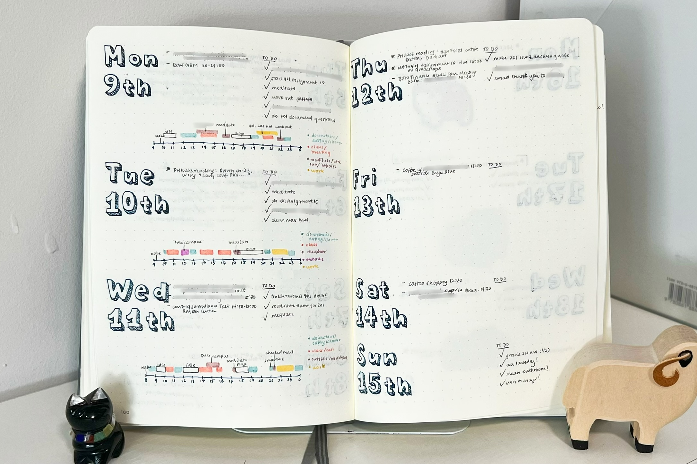
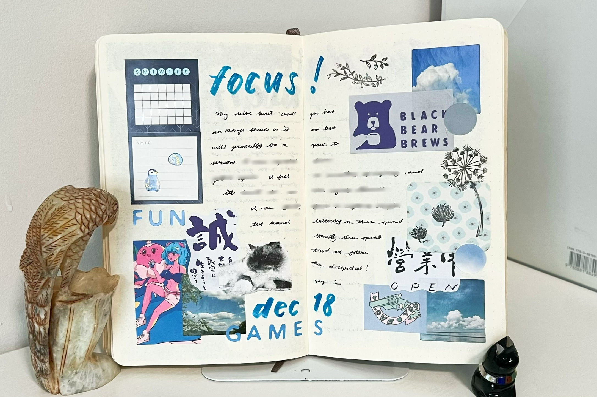

I'm someone who gets abundantly excited about trying new stationery and pens. Luckily, keeping journals gives me an excuse to use all my inks, stickers, washi tapes, brush pens, highlighters, and stamps that I hoard up in my office. This post serves as a **selected archive of some of my planner and bullet journal spreads**.[^1]

**Def:** Bullet Journal - "bujo" for short, is a method of personal organization. The system organizes scheduling, reminders, to-do lists, brainstorming, and other organizational tasks into a single notebook. While traditional rules of bullet journaling are outlined by [Ryder Carroll](https://bulletjournal.com/pages/about), I find that bujo styles are deeply personal. 

For my individual use, I had a "planner" (empty notebook that I could customize) that served as a traditional holder for to-do lists and events and a more artistically-inclined "bullet journal" where I could get more creative with spreads. 

### Quick Links 
1. [Planner 3: Orange Rhodia](#Rhodia) 
2. [Planner 2: Gray Leuchtturm](#Leuchtturm) 
3. [Planner 4: Mint Archer & Olive](#AO) 
4. [Planner 1: Tan Muji](#Muji) 
5. [Bullet Journal 1: Moleskine](#Moleskine) 
6. [Bullet Journal 2: Midori](#Midori)

--- 

### Orange Rhodia Planner

Quick facts: 
- Rhodia dot grid webnotebook: hardcover, thread-bound, 5.5 $\times$ 8.3 in, 96 sheets, 90 gsm ivory brushed vellum paper 
- in use May 2021 to Dec. 2022 
- different header design every week 
- one week per two pages, later changed to two weeks per two pages 

Some spreads I didn't end up using too much, but I still like the style I made. 

  
  
  
  
  

### Gray Leuchtturm Planner 

Quick facts: 
- Leuchtturm1917 dot grid medium (A5) notebook in anthracite: hardcover, thread-bound, 251 pages, 80 gsm paper, "slightly chamois colored paper"
- in use Aug. 2019 to Apr. 2021
- different header design every month
- one week per two pages

For some cursed reason I had decided to make every spread with fountain pen ink (Pilot Iroshizuku tsuki-yo), so there's more smudges in this planner, especially for the month grids where I used a ruler. Oh well, it's all now just part of its personality :). 

 

    The lettering is inspired by the Blooming Elegant <a href="https://www.fontspring.com/fonts/nicky-laatz/blooming-elegant">font</a> by Nicky Laatz.

 
 
 
 

### Mint A&O Planner 

Quick facts: 
- Archer & Olive dot grid A5 notebook: 160 pages, 160 gsm paper 
- in use Jan 2023 to Dec. 2024 
- different header design every week, then changed to every month halfway through 
- two weeks per two pages

I actually didn't use this planner as much as previous ones, but I continued making the spreads since I committed already, and honestly, I didn't want a halfway empty notebook. 

BTW, I actually don't recommend this notebook unless you're actively using paint markers or similar. 

 

    I called the spread on the left "deconstructed Starry Night" and on the right "translation".

 

    The words are handwriting inspired by the Risello Fruits <a href="https://www.dafont.com/risello-fruits.font">font</a> by Maulana Creative, and the fruits are stamps that I colored in with markers.

 
 

    Drawings are illustrations of mobs in <em>The Legend of Zelda: Echoes of Wisdom</em>. All rights go to Nintendo.

 

    Drawings of tree nuts and leaves from <a href="https://aplnj.com/native-trees-of-new-jersey">Almost Perfect Landscaping NJ</a>.

### Tan Muji Planner 

Quick facts: 
- Muji wirebound dot grid A5 notebook: 70 sheets, costed ~$5 
- in use Aug. 2018 to Jul. 2019  
- different header design every week 
- one week per two pages

I actually had similar planners before this one in high school, but those just feel too old to include. 

 
 
 

### Moleskine Bullet Journal 

Quick facts: 
- Moleskine classic dot grid notebook in black: softcover, large size (5 $\times$ 8.25 in), 70 gsm ivory-colored paper 
- in use Fall 2020 to end of 2022

These "bullet journal"-type spreads are where I could play more creatively, notably with more variations in structure, layout, color, size, etc. but still maintain a level of functionality with to-dos or journal entries. I tended to use a collage-like layering pattern. 

 
 

    On the right, illustrations based on the game <em>Enter the Gungeon</em>; all rights go to Dodge Roll game studio. Yes, I realize the spacing is off, but somehow I didn't notice when making it. Many such cases! On the left, illustrations based on the game <em>Among Us</em>; all rights go to Innersloth game studio.

 
 
 

    These stickers depict fictional characters called Sumikko Gurashi created by the company San-X.

 
 
 
 
 
 
 
 
 
 

    Pictures depict a fictional character in the manga <em>Demon Slayer</em> written and illustrated by Koyoharu Gotouge.

 
 
 

    Above pictures depict fictional characters in the manga <em>Jujutsu Kaisen</em> written and illustrated by Gege Akutami.

 
 
 
 
 

### Midori Bullet Journal 

Quick facts: 
- Midori MD notebook light, A6 grid: 24 sheets, MD paper 
- in use beginning to end of 2023

I totally started using this notebook upside down... and just continued with it. 

 
 
 
 
 

### What's next? 

I admittedly don't make spreads like I used to. Currently I'm using a Hobonichi Techo original for 2025 -- it has labelled dates and various calendar sections, so I don't need to create planner spreads like I did in the past. 

I believe the hobbies and things we love will eventually come back around in our lives, one way or another. So we'll just have to see how these years of bullet journaling influence me in the future :)! 

[^1]: I used to post on my inactive [studygram](https://www.instagram.com/mathxmatics/) and [studyblr](https://gpa-saver.tumblr.com/) what I found aesthetically pleasing examples of notes and spreads. 
