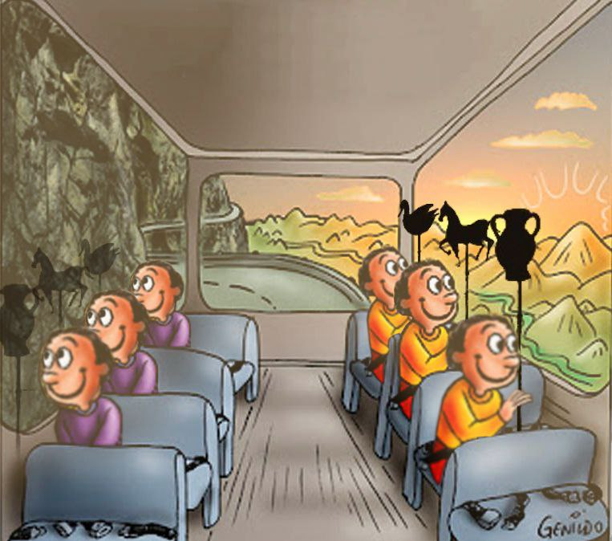
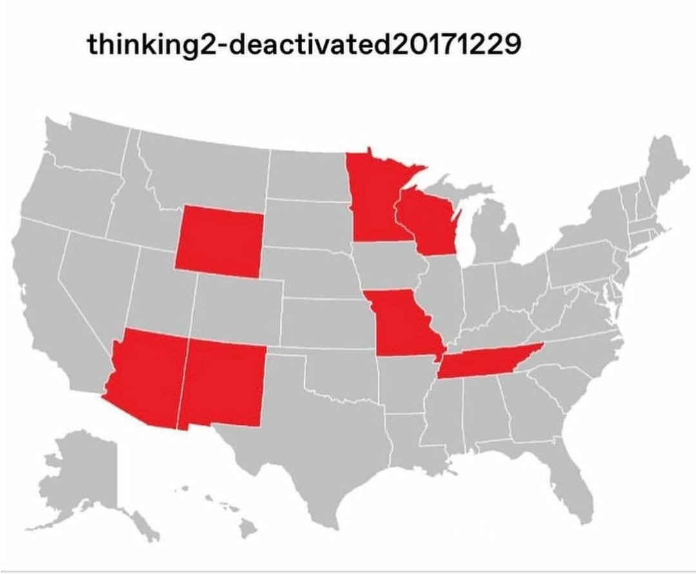
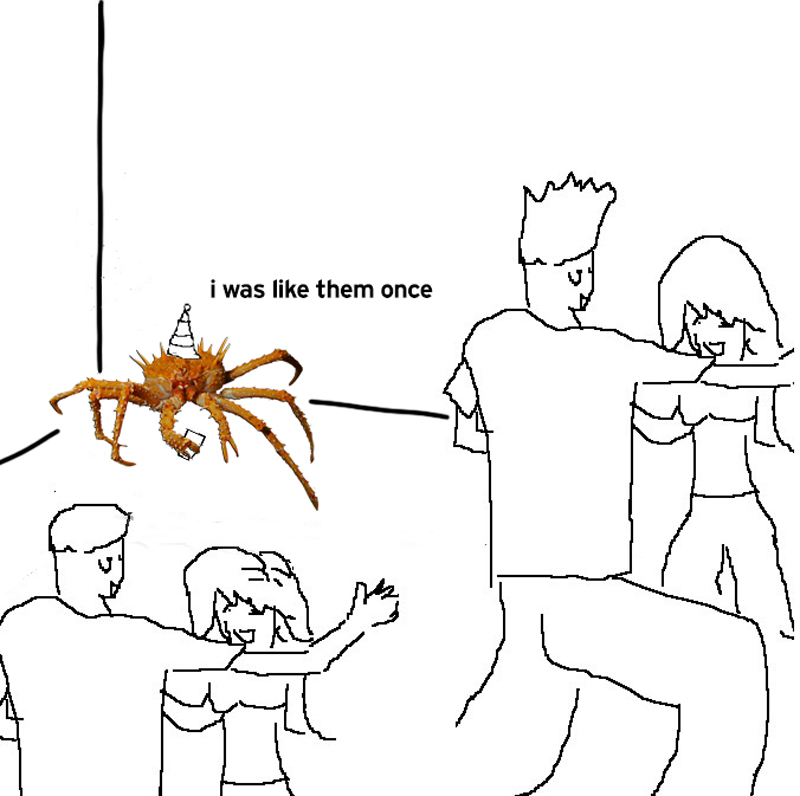

Hi! I'm Christine Yang, a recent grad at Duke University, where I studied mathematics and philosophy. I'm from Short Hills, NJ, but I currently live in Morristown, NJ. 

### Currently Reading 
- *Snow Country* by Yasunari Kawabata, trans. Edward G. Seidensticker 
- *The World According to Garp* by John Irving

### Fun Facts
- 600+ day streak on Duolingo 
- shortest Solitaire time is 31s
- once spent a day in China picking up panda droppings 

### Current Favorite Memes 

  

    
  

  

    
  

  

    
  

### Disclaimer 

This is a personal blog. Any views or opinions represented in this blog are belong solely to me and do not represent those of my employer.