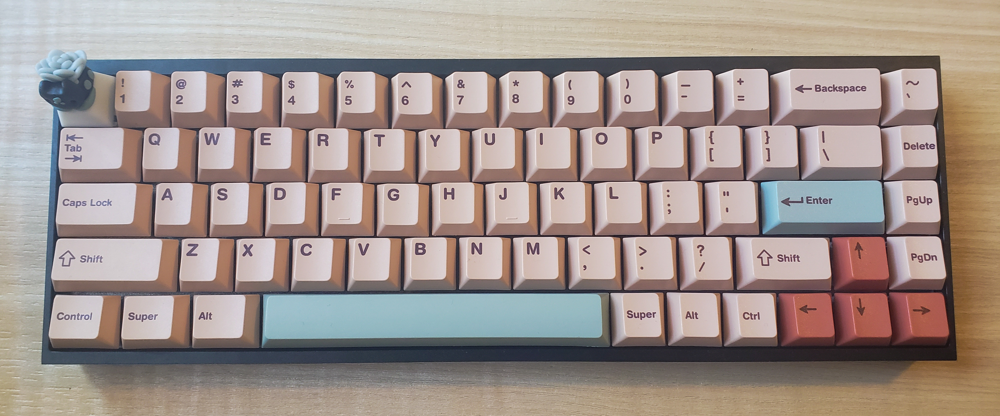
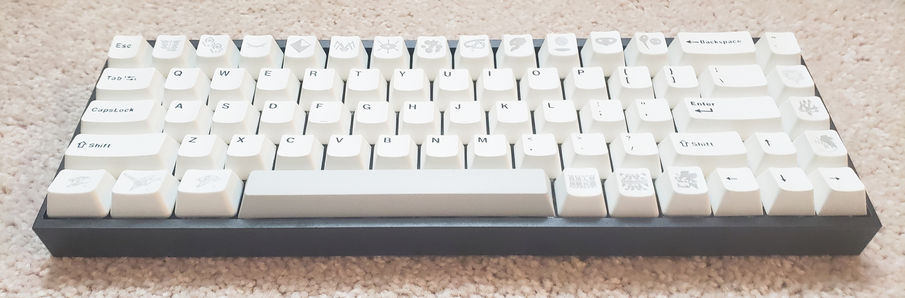

 

- Tofu65 Hotswap V3 DIY Kit ([KBDfans](https://kbdfans.com/products/dz68rgb-customize-keyboard-diy-kit))
   - black case
   - polycarbonate plate 
- Gazzew U4 Boba Silent Tactile switches ([SwagKeys](https://swagkeys.com/products/gazzew-u4-boba-silent-tactile-switches))
   - Tribosys 3203 lubricant ([Divinikey](https://divinikey.com/products/tribosys-3203-switch-lubricant))
- Durock V2 screw-in stabilizers ([Divinikey](https://divinikey.com/products/durock-v2-stabilizers-screw-in))
   - Krytox 205G0 lubricant ([Divinikey](https://divinikey.com/products/krytox-gpl-205-grade-0-switch-lubricant))
- Cherry Sand PBT Dye-Sub keycaps, Cherry profile ([NovelKeys](https://novelkeys.com/products/cherry-sand))
- Bulba-san artisan keycap ([Karakuri Caps](https://www.instagram.com/karakuri.caps/))

### The Process 

#### Lubing Switches 

While many switches come factory lubed, it is usually recommended to hand-lube them as well to your preference. The process from disassemling a switch and lubing it is detailed in this [Taeha Types video](https://youtu.be/44Wv4OGdmu4). Below are videos of my process. 

   

      <iframe width="300" height="300" src="https://www.youtube.com/embed/CfBYfgrrXYw" title="YouTube video player" frameborder="0" allow="accelerometer; autoplay; clipboard-write; encrypted-media; gyroscope; picture-in-picture" allowfullscreen></iframe>
   

   

      <iframe width="300" height="300" src="https://www.youtube.com/embed/hG-xDyr9Lek" title="YouTube video player" frameborder="0" allow="accelerometer; autoplay; clipboard-write; encrypted-media; gyroscope; picture-in-picture" allowfullscreen></iframe>
   

#### Lubing Stabilizers 

Stabilizers keep the longer keys (ex. shift, space bar) on the keyboard from wobbling. Lubing stabilizers is considered the most important keyboard mod as it makes the greatest difference. I followed this [Taeha Types video](https://youtu.be/usNx1_d0HbQ) for lubing the stabilizers. 

   <iframe width="300" height="300" src="https://www.youtube.com/embed/UNaTip3VXS0" title="YouTube video player" frameborder="0" allow="accelerometer; autoplay; clipboard-write; encrypted-media; gyroscope; picture-in-picture" allowfullscreen></iframe> 

#### Assembling Pieces 

The last thing to do is put all the pieces together! I didn't take a video of this, but usually you can find specific instructions online. To be honest, I installed the stabilizers incorrectly twice, so I'll be careful of that next time. 

### Conclusion 

I am extremely satisfied with my first keyboard build. I chose a 65% layout because I felt like it was the perfect balance of convenience. It has silent switches, so I don't have to worry about annoying everyone at the library. Next time, I hope to experiment with linear switches. The only thing I dislike is how heavy it is (although I believe it is a "normal" weight for a good mechanical keyboard). 
